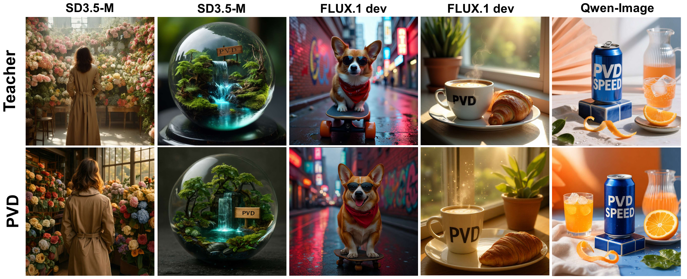
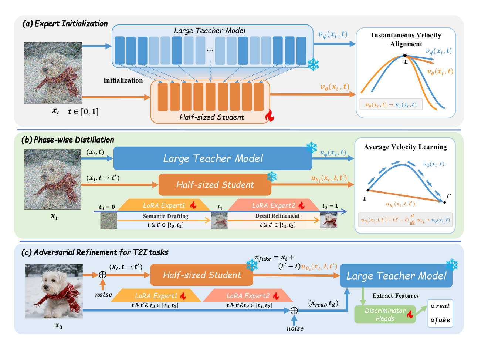
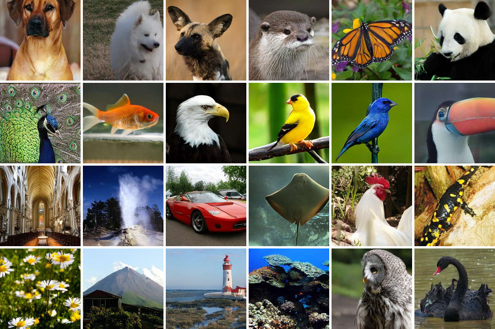

<div align="center">

<p></p>

<h1>Two Halves are More than One:<br>Phase-wise Velocity Distillation for Fast and High-Quality Image Generation</h1>

*Two complementary halves for high-quality image generation at roughly one full-backbone forward pass of compute.*

<strong>🚩 Accepted by NeurIPS 2026</strong>

<p><strong>Zhen Guo · Rongyuan Wu · Qiaosi Yi · Chenxi Xie · Xinyu Wei · Lei Zhang</strong><br>
The Hong Kong Polytechnic University · OPPO Research Institute</p>

<p>
<a href="https://arxiv.org/abs/2610.08070"></a>
<a href="https://github.com/PolyU-VCLab/PVD"></a>
<a href="https://huggingface.co/VCLab-PolyU/PVD"></a>
<a href="https://huggingface.co/papers/2610.08070"></a>
<a href="LICENSE"></a>
</p>

</div>

---

## 📌 Quick Links

[News](#news) · [Highlights](#highlights) · [Overview](#overview) · [Results](#results) · [Gallery](#gallery)

[Preparation](#preparation) · [Training](#training) · [Inference](#inference) · [Contact](#contact) · [Citation](#citation) · [License](#license)

If you find this repository helpful, please kindly give it a star ⭐.

<a id="news"></a>

## 📰 News
- 🚀 **Code released!** [Training](#training) and [inference](#inference) code is available for C2I and all three T2I backbones.
- 🤗 **Checkpoints released!** Download the [C2I, SD3.5 Medium, FLUX.1-dev and Qwen-Image models](#checkpoints), including the Unsplash variants.

---

<a id="highlights"></a>

## ✨ Highlights

PVD distills a teacher into **two complementary, half-depth experts**: the early expert establishes global structure, and the late expert refines detail. The experts run sequentially, once each, sharing the computation budget of approximately one full teacher-backbone forward pass.

- **Near-teacher ImageNet quality at 1/500 of the sampling FLOPs.** On ImageNet 256×256, PVD achieves **FID-50K 1.48 · IS 295.89**, approaching the multi-step LightningDiT teacher's FID of **1.35** with normalized sampling FLOPs of **1.00 vs. 500.00**.
- **Strong text-to-image results across three backbones.** PVD reaches GenEval **0.6948 / 0.6532 / 0.8846** on **SD3.5 Medium / FLUX.1-dev / Qwen-Image**, respectively, under the same approximate single-forward compute budget.
- **Smaller experts, lower memory use.** Across the T2I backbones, PVD uses **49.10–50.89% fewer active parameters** and **45.76–48.36% less peak VRAM** than the multi-step teachers.

<div align="center">

<p><sub>Multi-step teachers (top) and PVD students (bottom).</sub></p>
</div>

---

<a id="overview"></a>

## 🧭 Overview

<div align="center">

<p><sub>Backbone initialization → Phase-wise velocity distillation → Adversarial refinement.</sub></p>
</div>

We first extract and align a half-depth backbone from the teacher. Each phase expert is then distilled on a shorter time interval with a local mean-velocity objective. For T2I, phase-specific adversarial supervision further improves perceptual detail. At inference, the late expert consumes the early expert's intermediate state.

---

<a id="results"></a>

## 📊 Quantitative Results

### ImageNet 256×256

FID is computed on 50K class-conditional samples. Lower FID and higher Inception Score (IS) are better. `N_flops` is sampling FLOPs normalized by one full teacher-backbone forward pass; the multi-step LightningDiT teacher is shown for context.

| Method | Params | `N_flops` | FID-50K ↓ | IS ↑ |
| :--- | :---: | :---: | :---: | :---: |
| LightningDiT (multi-step) | 675M | 500.00 | 1.35 | 295.30 |
| MeanFlow | 676M | 1.00 | 3.43 | — |
| α-Flow | 675M | 1.00 | 2.58 | — |
| FACM | 675M | 1.00 | 1.76 | — |
| iMF | 610M | 1.00 | 1.72 | 282.00 |
| **PVD** | **676M** | **1.00** | **1.48** | **295.89** |

PVD's FID is only **0.13** above the multi-step teacher's, with comparable IS, at **1/500 of its normalized sampling FLOPs**.

### Text-to-Image Generation

Each table compares a multi-step teacher, a representative accelerated baseline and PVD. Higher is better for all quality metrics.

#### SD3.5 Medium

| Method | GenEval ↑ | DPG ↑ | WISE ↑ | Qwen-Image-Bench ↑ | Aesthetic ↑ | PickScore ↑ | ImageReward ↑ |
| :--- | :---: | :---: | :---: | :---: | :---: | :---: | :---: |
| Teacher | 0.6829 | 84.49 | 0.45 | 43.19 | 5.7212 | 21.45 | 0.6127 |
| SWD | 0.6286 | 79.23 | 0.36 | 31.44 | 4.9440 | 20.53 | 0.3578 |
| **PVD** | **0.6948** | **81.81** | **0.40** | **35.51** | **5.4618** | **20.84** | **0.4947** |

#### FLUX.1-dev

| Method | GenEval ↑ | DPG ↑ | WISE ↑ | Qwen-Image-Bench ↑ | Aesthetic ↑ | PickScore ↑ | ImageReward ↑ |
| :--- | :---: | :---: | :---: | :---: | :---: | :---: | :---: |
| Teacher | 0.6675 | 83.95 | 0.50 | 43.52 | 5.9286 | 21.81 | 0.8139 |
| SWD | 0.6285 | 82.43 | 0.37 | 39.71 | 5.3846 | 21.22 | 0.6562 |
| **PVD** | **0.6532** | **82.83** | **0.44** | **43.14** | **5.7145** | **21.32** | **0.6747** |

#### Qwen-Image

| Method | GenEval ↑ | DPG ↑ | WISE ↑ | Qwen-Image-Bench ↑ | Aesthetic ↑ | PickScore ↑ | ImageReward ↑ |
| :--- | :---: | :---: | :---: | :---: | :---: | :---: | :---: |
| Teacher | 0.8720 | 89.10 | 0.64 | 48.78 | 5.8584 | 21.90 | 0.9852 |
| TwinFlow | 0.8338 | 86.75 | 0.57 | 46.16 | 5.5880 | 21.42 | 0.9042 |
| **PVD** | **0.8846** | **86.54** | **0.59** | **46.85** | **5.7526** | **21.66** | **0.9063** |

### Deployment Cost

The cost figures below are from the paper's evaluation; active parameters and peak VRAM are shown as teacher → PVD, with the reduction relative to the teacher.

| Backbone | PVD `N_flops` | Active params (B) | Peak VRAM (GiB) |
| :--- | :---: | :---: | :---: |
| SD3.5 Medium | 0.99 | 2.24 → **1.10**<br>↓50.89% | 4.99 → **2.67**<br>↓46.49% |
| FLUX.1-dev | 1.01 | 11.90 → **5.98**<br>↓49.75% | 22.64 → **12.28**<br>↓45.76% |
| Qwen-Image | 1.02 | 20.43 → **10.40**<br>↓49.10% | 38.42 → **19.84**<br>↓48.36% |

---

<a id="gallery"></a>

## 🎨 Visual Results

[ImageNet](#imagenet-gallery) · [Text-to-image](#t2i-gallery) · [Unsplash](#unsplash-gallery)

<a id="imagenet-gallery"></a>

### ImageNet Class-Conditional Generation

PVD samples for 256×256 class-conditional generation:

<div align="center">

</div>

<a id="t2i-gallery"></a>

### Text-to-Image Generation

PVD samples for 1024×1024 text-to-image, grouped by backbone:

#### SD3.5 Medium

<div align="center">

</div>

#### FLUX.1-dev

<div align="center">

</div>

#### Qwen-Image

<div align="center">

</div>

<a id="unsplash-gallery"></a>

### Further Training on Unsplash

Further training on Unsplash improves lighting, texture and realism, showing that PVD can effectively adapt the visual characteristics of high-quality training data into the generation process beyond teacher imitation.

#### SD3.5 Medium

<div align="center">

</div>

#### FLUX.1-dev

<div align="center">

</div>

#### Qwen-Image

<div align="center">

</div>

---

<a id="setup"></a>

<a id="preparation"></a>

## 🧰 Preparation

### Dependencies and Installation

Use a Python environment with a CUDA-enabled GPU. Clone the repository and install its dependencies:

```bash
git clone https://github.com/PolyU-VCLab/PVD.git
cd PVD
pip install -r requirements.txt
```

Run subsequent commands from the `PVD` repository root.

<a id="checkpoints"></a>

### 📦 Model Weights

**All seven student variants are available on [Hugging Face](https://huggingface.co/VCLab-PolyU/PVD).** Each model link opens its weight folder. Place `weights/` and `cache/` in this repository root, preserving the directory names below.

```text
PVD/
├── weights/   # PVD student checkpoints and adapters
├── cache/     # C2I decoder, statistics and teacher checkpoint
├── models/    # T2I base model components
├── data/      # ImageNet latents and image–caption manifests
└── outputs/   # Generated images and training runs
```

| Model / download | Local weight directory | Released components |
| :--- | :--- | :--- |
| [C2I](https://huggingface.co/VCLab-PolyU/PVD/tree/main/weights/pvd_c2i) | `weights/pvd_c2i/` | `model.safetensors` |
| [SD3.5 Medium](https://huggingface.co/VCLab-PolyU/PVD/tree/main/weights/pvd_sd35m) | `weights/pvd_sd35m/` | `part1.safetensors`, `part2.safetensors`, `model_config.json` |
| [SD3.5 Medium (Unsplash)](https://huggingface.co/VCLab-PolyU/PVD/tree/main/weights/pvd_sd35m_unsplash) | `weights/pvd_sd35m_unsplash/` | `part1.safetensors`, `part2.safetensors`, `model_config.json` |
| [FLUX.1-dev](https://huggingface.co/VCLab-PolyU/PVD/tree/main/weights/pvd_flux) | `weights/pvd_flux/` | `backbone.safetensors`, `part1/` & `part2/` LoRA adapters |
| [FLUX.1-dev (Unsplash)](https://huggingface.co/VCLab-PolyU/PVD/tree/main/weights/pvd_flux_unsplash) | `weights/pvd_flux_unsplash/` | `part1/` & `part2/` adapters; shared FLUX backbone below |
| [Qwen-Image](https://huggingface.co/VCLab-PolyU/PVD/tree/main/weights/pvd_qwenimage) | `weights/pvd_qwenimage/` | `backbone.safetensors`, `part1/` & `part2/` LoRA adapters |
| [Qwen-Image (Unsplash)](https://huggingface.co/VCLab-PolyU/PVD/tree/main/weights/pvd_qwen_unsplash) | `weights/pvd_qwen_unsplash/` | `part1/` & `part2/` adapters; shared Qwen backbone below |

The Unsplash FLUX and Qwen-Image variants reuse `weights/pvd_flux/backbone.safetensors` and `weights/pvd_qwenimage/backbone.safetensors`, respectively. Each LoRA folder contains `adapter_model.safetensors` and `adapter_config.json`. For C2I inference, download the [decoder and latent statistics](https://huggingface.co/VCLab-PolyU/PVD/tree/main/cache) as `cache/vavae-imagenet256-f16d32-dinov2.pt` and `cache/latents_stats.pt`.

#### Base Model Components

For T2I, place the base model's VAE, tokenizers and text encoders in `models/stable-diffusion-3.5-medium/`, `models/FLUX.1-dev/`, or `models/Qwen-Image/`, and pass that directory with `--model-root`.

<a id="training-data"></a>

### 🗂️ Training Data

Dataset sources and training assets are listed below.

| Stage | Data used in the paper | Source / local preparation |
| :--- | :--- | :--- |
| C2I training | ImageNet-256; FACM weights & statistics | [HuggingFace](https://huggingface.co/Peterande/FACM/tree/main) |
| T2I backbone initialization | BLIP3o long captions | [BLIP3o-Pretrain-Long-Caption](https://huggingface.co/datasets/BLIP3o/BLIP3o-Pretrain-Long-Caption) |
| T2I phase distillation | BLIP3o-60k; also Echo-4o for Qwen-Image | [BLIP3o-60k](https://huggingface.co/datasets/BLIP3o/BLIP3o-60k) · [Echo-4o-Image](https://huggingface.co/datasets/Yejy53/Echo-4o-Image) |
| Further T2I training | Unsplash photographs | [Unsplash Dataset](https://unsplash.com/data) |

#### Class-Conditional Generation (C2I)

Download the FACM weights and statistics linked above. Place `fid-50k-256.npz`, `latents_stats.pt` and `vavae-imagenet256-f16d32-dinov2.pt` in `cache/`. Prepare ImageNet latents following [Lightning-DiT](https://github.com/hustvl/LightningDiT/blob/main/docs/tutorial.md).

#### Text-to-Image Generation (T2I)

For T2I, create a JSONL manifest with one record per image. `image_path` must be relative to `IMAGE_ROOT`; `caption` must contain the training text:

```json
{"image_path": "images/000001.jpg", "caption": "A red apple on a wooden table"}
```

Set `DATA_FILE` to this manifest and `IMAGE_ROOT` to its image root in the [training commands](#training). Text is encoded online by default.

---

<a id="training"></a>

## 🧪 Training

Complete [Preparation](#preparation), then adjust the GPU count and local paths in the commands below to your setup.

| Task | Entry point | Loss implementation |
| :--- | :--- | :--- |
| C2I | [train.py](train.py) | [losses/c2i.py](losses/c2i.py) |
| SD3.5 Medium | [train_t2i_sd3.py](train_t2i_sd3.py) | [losses/sd35.py](losses/sd35.py) |
| FLUX.1-dev | [train_t2i_flux.py](train_t2i_flux.py) | [losses/flux.py](losses/flux.py) |
| Qwen-Image | [train_t2i_qwenimage.py](train_t2i_qwenimage.py) | [losses/qwenimage.py](losses/qwenimage.py) |

### Class-Conditional Generation (C2I)

```bash
GPUS=8
export C2I_TEACHER_CHECKPOINT=cache/800ep-stg1.pt

accelerate launch --num_processes "$GPUS" --mixed_precision bf16 train.py \
  --data-dir data/imagenet_latents \
  --results-dir outputs/c2i \
  --distill --intervals 0.4_0.6 --overlap 0.0
```

### Text-to-Image Generation (T2I)

Use [scripts/train_t2i.sh](scripts/train_t2i.sh) with the full teacher transformer in each base-model directory. Train the two phases separately: run with `PART=1`, then repeat with `PART=2`. Accelerate / DeepSpeed configurations are in [scripts/config/](scripts/config/).

```bash
TASK=flux PART=1 GPUS=8 DATA_FILE=data/blip3o/train.jsonl IMAGE_ROOT=data/blip3o/images \
  FLUX_MODEL_ROOT=models/FLUX.1-dev bash scripts/train_t2i.sh

TASK=sd35 PART=1 GPUS=8 DATA_FILE=data/blip3o/train.jsonl IMAGE_ROOT=data/blip3o/images \
  SD35_MODEL_ROOT=models/stable-diffusion-3.5-medium bash scripts/train_t2i.sh

TASK=qwenimage PART=1 GPUS=8 DATA_FILE=data/blip3o/train.jsonl IMAGE_ROOT=data/blip3o/images \
  QWENIMAGE_MODEL_ROOT=models/Qwen-Image bash scripts/train_t2i.sh
```

---

<a id="inference"></a>

## 🔍 Inference

Single-GPU inference with the [prepared models](#checkpoints). Outputs are saved to the path specified by `--output`.

### Class-Conditional Generation (C2I)

```bash
# ImageNet class ID 207
python infer.py --task c2i --class-id 207 --output outputs/c2i.png
```

### Text-to-Image Generation (T2I)

```bash
python infer.py --task sd35 --model-root models/stable-diffusion-3.5-medium \
  --prompt "A red apple on a wooden table" --output outputs/sd35.png
python infer.py --task flux --model-root models/FLUX.1-dev \
  --prompt "A red apple on a wooden table" --output outputs/flux.png
python infer.py --task qwenimage --model-root models/Qwen-Image \
  --prompt "A red apple on a wooden table" --output outputs/qwenimage.png
```

### Unsplash Variants

```bash
python infer.py --task sd35_unsplash --model-root models/stable-diffusion-3.5-medium \
  --prompt "A red apple on a wooden table" --output outputs/sd35_unsplash.png
python infer.py --task flux_unsplash --model-root models/FLUX.1-dev \
  --prompt "A red apple on a wooden table" --output outputs/flux_unsplash.png
python infer.py --task qwenimage_unsplash --model-root models/Qwen-Image \
  --prompt "A red apple on a wooden table" --output outputs/qwenimage_unsplash.png
```

### Common Arguments

| Argument | Purpose |
| :--- | :--- |
| `--task` | Select a student variant from the [model table](#checkpoints) |
| `--weights-dir` | Parent directory of the student weight folders; default: `weights/` |
| `--model-root` | Base model directory; required for T2I |
| `--class-id` | ImageNet class ID for C2I (0–999) |
| `--part1_steps`, `--part2_steps` | T2I steps per phase; both default to `1` |

---

<a id="contact"></a>

## 📬 Contact
If you have any questions or suggestions, please feel free to contact: zhen-gz.guo@connect.polyu.hk.

<a id="citation"></a>

## 📖 Citation

If you find PVD useful, please consider citing our work:

```bibtex
@inproceedings{guo2026pvd,
  title = {Two Halves are More than One: Phase-wise Velocity Distillation for Fast and High-Quality Image Generation},
  author = {Guo, Zhen and Wu, Rongyuan and Yi, Qiaosi and Xie, Chenxi and Wei, Xinyu and Zhang, Lei},
  booktitle = {Advances in Neural Information Processing Systems},
  year = {2026}
}
```

<a id="license"></a>

## 📄 License

Code is licensed under the [Apache License 2.0](LICENSE). Third-party code and components retain their respective licenses and copyright notices. Model weights are subject to the applicable upstream model licenses.

## 🙏 Acknowledgements

This repository is built upon [FACM](https://github.com/ali-vilab/FACM), [Transformers](https://github.com/huggingface/transformers), and [Diffusers](https://github.com/huggingface/diffusers).
We thank the authors for their awesome work!
